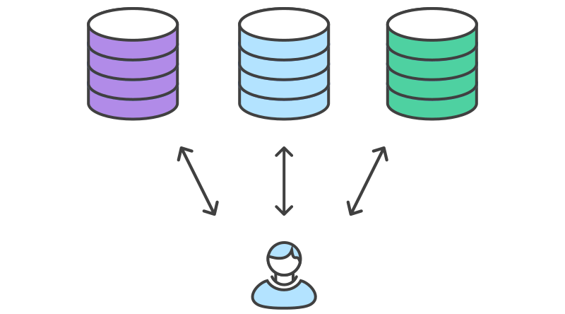

# ENVIROMENTS

As configurações desta documentação são somente exemplos de implementação.

Durante o desenvolvimento de aplicações em determinado momento você pode se deparar com a necessidade de utilizar mais de um banco de dados: um banco local e o outro o banco de produção, por exemplo.



Em NestJS há várias formas de fazer com que a sua aplicação permita alternar entre eles. Veja como é fácil:

## Instalando as dependências:

Para iniciar, instale os pacotes nest-config e dotenv-flow que permitirão nossa aplicação utilizar mais de um arquivo de configuração .env.

## Usando NPM:

```
$ npm install --save nestjs-config dotenv-flow
```

## Configurando o suporte ao .env:

Verifique se na pasta raiz da sua aplicação está criado o arquivo .env, se não tiver, crie-o. Crie também um arquivo com o nome .env.production

```
Pasta do Projeto/
├── node_modules/
├── src/
├── .env
└── .env.production
```

Estes 2 arquivos irão receber informações sensíveis da sua aplicação, como por exemplo, os dados de acesso do seu banco de dados. Por isso, adicione eles ao arquivo .gitignore que se encontra na raiz do seu projeto.

## .gitignore:

```
# Environment
.env
.env.production
```

Abra o arquivo .env e coloque os dados de acesso do seu banco de dados, por exemplo:

## .env:

```
TYPEORM_HOST=localhost

# nome do banco de dados local
TYPEORM_DATABASE=nest_db

# nome do usuário do banco local
TYPEORM_USERNAME=nest

# senha do usuário local
TYPEORM_PASSWORD=123456

# porta do banco local
TYPEORM_PORT=3306
TYPEORM_SYNCHRONIZE=true
```

Agora abra o arquivo .env.production e configure com os dados do banco de dados de produção.

## .env.production:

```
# propriedade necessária apenas para casos de banco diferentes
TYPEORM_TYPE=postgres

# endereço do banco em produção
TYPEORM_HOST=sql.main-hosting.eu

# nome do banco de dados
TYPEORM_DATABASE=nest_db_prod

# nome do usuário do banco
TYPEORM_USERNAME=nest_adm

# senha do usuário
TYPEORM_PASSWORD=1@b23$a#%21

# porta do banco
TYPEORM_PORT=5432
TYPEORM_SYNCHRONIZE=true
```

Crie agora o arquivo app.module.ts em:

```
Pasta do Projeto/
├── node_modules/
├── src/
│   └── app.module.ts
├── .env
└── .env.production
```

Habilite o pacote Nest-Config no app.module.ts:

```
import { Module } from '@nestjs/common';
import { ConfigModule } from 'nestjs-config';

@Module({
    imports: [
    ConfigModule.forRoot(),
    TypeOrmModule.forRoot({
      type: process.env.TYPEORM_CONNECTION as any,
      host: process.env.TYPEORM_HOST,
      port: parseInt(process.env.TYPEORM_PORT),
      username: process.env.TYPEORM_USERNAME,
      password: process.env.TYPEORM_PASSWORD,
      database: process.env.TYPEORM_DATABASE,
      entities: [process.env.TYPEORM_ENTITIES],
      migrations: [process.env.TYPEORM_MIGRATIONS],
      cli: {
        migrationsDir: process.env.TYPEORM_MIGRATIONS_DIR,
      },
      synchronize: process.env.TYPEORM_SYNCHRONIZE === 'true',
    }),
    WinstonModule.forRoot(winstonConfig),
    UsersModule,
  ],
})
export class AppModule {}
```
