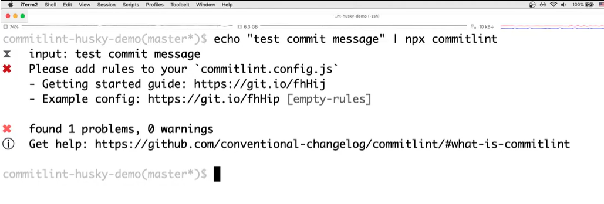
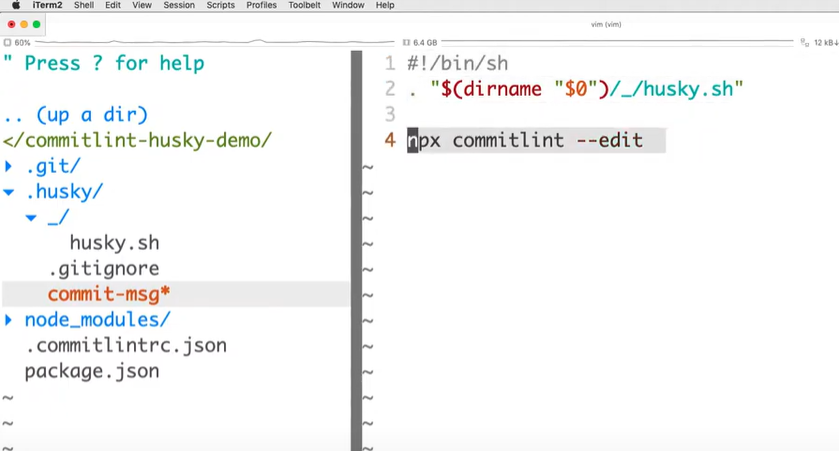

# Husky

Comece instalando o commitlint

```
$ npm install @commitlint/cli @commitlint/config-conventional --save-dev
```
Vamos fazer um teste:

```
$ echo "test commit message" | npx commitlint
```

O resultado deverá ser:



Crie um arquivo na raiz do projeto chamado **commitlint.config.js** e refaça o teste e nenhuma resposta deve ser dado indicando que não há erros na mensagem de commit.

```
module.exports = {
    extends: ['@commitlint/config-conventional'],
  };
```

```
$ echo "feat: test commit message" | npx commitlint
```
## Instalação o Husky

```
$ npm i husky -D
```

Em seguida configure os script para que posteriormente quando for instalar os pacotes, os hooks sejam instanciados automaticamente.

```
"scripts": {
    "postinstall": "husky install"
}
```

Ou se preferir pode fazer manualmente com:

```
$ npx husky install
```

```
$ npx husky add .husky/commit-msg "npx commitlint --edit $1"
```
Com isso, os arquivos ficam da seguinte forma:



Depois de feito isso e feito GIT ADD ., façamos o teste que deverá dar erro:

```
$ git commit -m "feat: This should fail"
```

Fonte de referência: [Entrar](https://remarkablemark.org/blog/2019/05/29/git-husky-commitlint/#husky)

Vídeo de referência


[](https://www.youtube.com/watch?v=2J9VnYiZ_Ts)